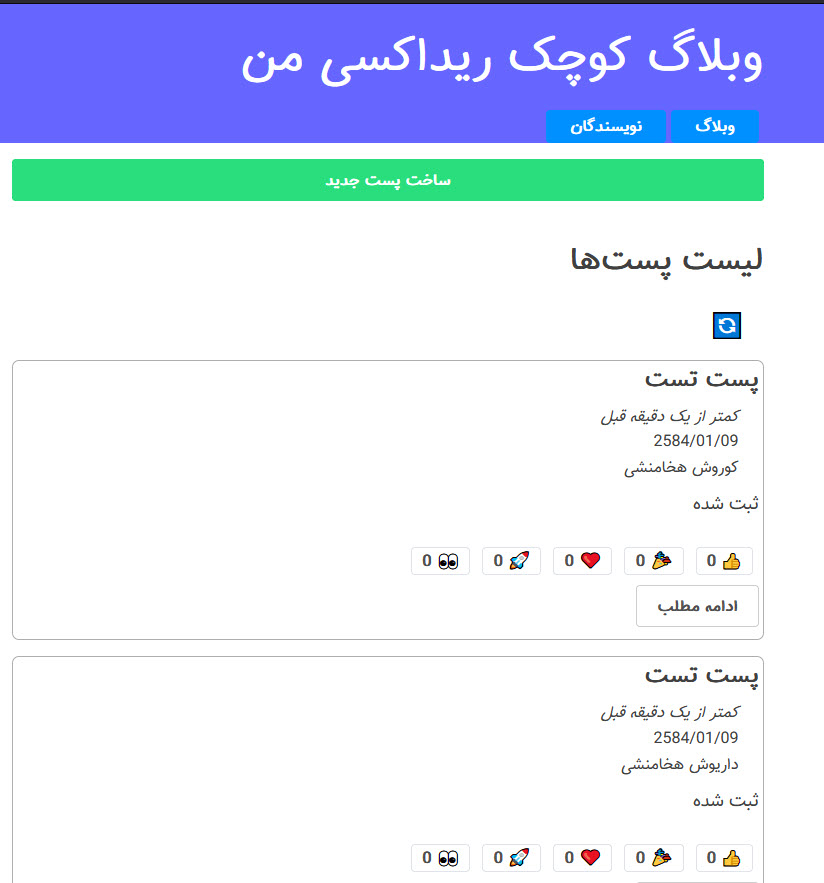

# فرانت‌اند وبلاگ Redux

این پروژه یک برنامه فرانت‌اند برای یک وبلاگ است که با استفاده از React و Vite ساخته شده است. این پروژه از Redux برای مدیریت وضعیت استفاده می‌کند و تجربه توسعه مدرنی با ویژگی‌هایی مانند به‌روزرسانی ماژول داغ (HMR) ارائه می‌دهد.



## ویژگی‌ها

- **React + Vite**: محیط توسعه سریع و کارآمد.
- **Redux**: مدیریت وضعیت متمرکز برای به‌روزرسانی‌های پیش‌بینی‌پذیر.
- **Redux Toolkit (RTK)**: ابزارهای ساده‌تر و قدرتمندتر برای مدیریت وضعیت و ایجاد اسلایس‌ها.
- **RTK Query**: مدیریت درخواست‌های API و کش کردن داده‌ها به صورت خودکار.
- **ESLint**: تضمین کیفیت و یکپارچگی کد.
- **HMR**: به‌روزرسانی‌های فوری در زمان توسعه بدون از دست دادن وضعیت.

## شروع به کار

1. مخزن را کلون کنید:
   ```bash
   git clone https://github.com/your-repo/redux-blog-frontend.git
   ```
2. به دایرکتوری پروژه بروید:
   ```bash
   cd redux-blog-frontend
   ```
3. وابستگی‌ها را نصب کنید:
   ```bash
   npm install
   ```
4. سرور توسعه را اجرا کنید:
   ```bash
   npm run dev
   ```

## گسترش تنظیمات ESLint

اگر در حال توسعه یک برنامه تولیدی هستید، توصیه می‌کنیم از TypeScript استفاده کنید و قوانین lint آگاه به نوع را فعال کنید. الگوی [TS](https://github.com/vitejs/vite/tree/main/packages/create-vite/template-react-ts) را بررسی کنید تا TypeScript و [`typescript-eslint`](https://typescript-eslint.io) را در پروژه خود ادغام کنید.

## توضیحات درباره Redux و امکانات API Slice

Redux یک کتابخانه مدیریت وضعیت است که به شما امکان می‌دهد وضعیت برنامه خود را به صورت متمرکز مدیریت کنید. Redux Toolkit (RTK) ابزار رسمی برای کار با Redux است که فرآیندهای پیچیده را ساده‌تر می‌کند. یکی از ویژگی‌های کلیدی RTK، API Slice است که به شما امکان می‌دهد:

- درخواست‌های API را به راحتی مدیریت کنید.
- داده‌ها را به صورت خودکار کش کنید.
- وضعیت بارگذاری و خطا را مدیریت کنید.
- کدهای مرتبط با درخواست‌های API را به صورت ماژولار و تمیز سازماندهی کنید.

برای اطلاعات بیشتر، مستندات [Redux Toolkit](https://redux-toolkit.js.org/) را بررسی کنید.

## اطلاعات بیشتر

- [مستندات Vite](https://vitejs.dev/)
- [مستندات React](https://reactjs.org/)
- [مستندات Redux](https://redux.js.org/)
- [مخزن بک‌اند پروژه](https://github.com/SayyehBan/redux-blog-backend)

با خیال راحت این پروژه را بررسی و در آن مشارکت کنید!
